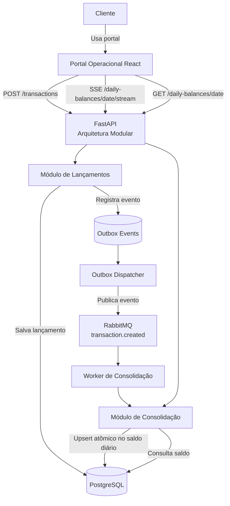

# Cash Flow Architecture Challenge

## Objetivo

Implementar uma solução simples e proporcional para controle de fluxo de caixa diário, com registro de lançamentos de crédito e débito e consulta de saldo consolidado por dia.

A solução foi desenhada para atender ao fluxo de caixa diário com separação clara entre lançamento e consolidação. A escolha por uma arquitetura modular com comunicação assíncrona via RabbitMQ garante resiliência no ponto mais crítico do desafio, mantendo simplicidade operacional e evitando complexidade desnecessária.

## Solução proposta

A arquitetura foi desenhada como um monólito modular, separando os domínios de Lançamentos e Consolidação.

A comunicação entre os domínios ocorre de forma assíncrona via RabbitMQ. Essa decisão atende ao requisito de que o controle de lançamentos continue funcionando mesmo quando a consolidação estiver indisponível.

A escolha por monólito modular evita complexidade operacional desnecessária, mantendo a possibilidade de evolução futura para microsserviços caso os domínios cresçam de forma independente.

## Arquitetura



Fluxo principal:

1. Cliente chama `POST /transactions`.
2. API valida os dados.
3. Lançamento é salvo em `transactions`.
4. Evento `TRANSACTION_CREATED` é salvo em `outbox_events` na mesma transação.
5. Outbox Dispatcher publica o evento na fila `transaction.created`.
6. Worker consome a mensagem.
7. Worker atualiza `daily_balances` com upsert atômico.
8. Worker grava `processed_events` para evitar duplicidade.

## Decisões arquiteturais

- Monólito modular em vez de múltiplos microsserviços.
- PostgreSQL para consistência e integridade transacional.
- RabbitMQ para desacoplar lançamento e consolidação.
- Worker assíncrono para processar o saldo diário.
- Outbox Pattern para evitar perda de evento entre banco e RabbitMQ.
- Upsert atômico no consolidado diário para reduzir risco de concorrência.
- Atualização em tempo real do resumo diário via Server-Sent Events.
- Fila offline local no portal com IndexedDB e `client_request_id` idempotente na API.
- Alembic para versionar o schema do banco.
- API Key simples para proteger endpoints no escopo do desafio.
- Portal operacional React para demonstrar criação, listagem e consulta do consolidado.
- Logs estruturados com métricas, endpoint `/metrics` e healthcheck.

Os ADRs estão em `docs/adr/`.

## Requisitos atendidos

- Controle de lançamentos: `POST /transactions` e `GET /transactions`.
- Consolidado diário: `GET /daily-balances/{date}`.
- Resumo diário em tempo real: `GET /daily-balances/{date}/stream`.
- Portal operacional: `frontend/`.
- Registro offline no portal com sincronização automática: `docs/offline-mode.md`.
- Domínios e capacidades: `docs/domains.md`.
- Requisitos funcionais e não funcionais: `docs/requirements.md`.
- Arquitetura alvo: `docs/architecture.md`.
- Justificativa tecnológica: `docs/adr/`.
- Segurança: `docs/security.md`.
- Observabilidade: `docs/observability.md`.
- Custos: `docs/costs.md`.
- Escalabilidade e plano de crescimento: `docs/scalability.md`.
- Arquitetura de transição: `docs/transition-architecture.md`.
- Prontidão final para avaliação local: `docs/production-readiness.md`.
- Checklist de aderência ao desafio: `docs/compliance-checklist.md`.
- Evidências de verificação: `docs/verification.md`.
- Guia de instalação e uso local: `docs/user-guide.md`.
- Histórico da sessão de desenvolvimento: `docs/development-session-2026-05-20.md`.
- Migração versionada com Alembic: `src/database/alembic/versions/`.
- Testes unitários, integração leve e carga.
- CI no GitHub Actions para testes de backend, frontend, build e validação do Docker Compose.

## Como rodar localmente

Este é o caminho oficial da entrega. O avaliador precisa apenas de Git e Docker com Docker Compose.

Windows PowerShell:

```powershell
git clone https://github.com/evosoftwares/cashflow-challenge-Gabriel.git
cd cashflow-challenge-Gabriel
Copy-Item .env.example .env
docker compose up --build
```

macOS/Linux:

```bash
git clone https://github.com/evosoftwares/cashflow-challenge-Gabriel.git
cd cashflow-challenge-Gabriel
cp .env.example .env
docker compose up --build
```

No Windows, mantenha o Docker Desktop aberto antes de executar o comando `docker compose up --build`.

O serviço `migrate` executa `alembic upgrade head` automaticamente antes da API, do worker e do dispatcher de Outbox.

URLs locais:

```text
Portal operacional: http://localhost:5173
API: http://localhost:8000
Swagger/OpenAPI: http://localhost:8000/docs
RabbitMQ Management: http://localhost:15672
```

O portal usa a chave local configurada por variável de ambiente para consumir a API sem expor esse campo ao operador.

Guia passo a passo de instalação e uso: `docs/user-guide.md`.

## Como utilizar o portal

1. Abra `http://localhost:5173`.
2. Use o merchant de demonstração já preenchido ou gere um novo identificador.
3. Escolha a data de operação.
4. Registre uma entrada ou saída.
5. Acompanhe a tabela de movimentações do dia.
6. Veja o resumo diário atualizar automaticamente.

## Fluxo online/offline do portal

O portal operacional funciona em modo offline quando a tela já está aberta e a API ou a rede fica indisponível. Nesse cenário, o lançamento é salvo em uma fila local no navegador usando IndexedDB, aparece na tabela com selo `Pendente` e é sincronizado automaticamente quando a conexão volta.

O portal também possui `manifest.webmanifest` e service worker para cache do app shell em builds de produção do front-end. No caminho oficial do desafio, a validação completa continua sendo local via Docker Compose.

Cada tentativa enviada pelo portal usa um `client_request_id`. A API mantém esse campo com índice único em `transactions`; se o mesmo lançamento for reenviado, a transação existente é retornada sem criar nova linha nem novo evento de Outbox.

Limite assumido: os dados pendentes ficam apenas no navegador do operador até a sincronização. Abrir ou recarregar o portal totalmente sem rede, com app shell offline, é uma evolução futura de PWA/service worker.

Para executar a migration manualmente:

```bash
make migrate
```

Healthcheck:

```bash
curl http://localhost:8000/health
```

RabbitMQ Management:

```text
http://localhost:15672
usuario: guest
senha: guest
```

## Como executar os testes

Instale as dependências de desenvolvimento:

```bash
python -m venv .venv
source .venv/bin/activate
pip install -e ".[dev]"
make test
```

Testes do front-end:

```bash
make frontend-install
make frontend-test
make frontend-build
```

Também é possível rodar diretamente:

```bash
pytest
```

Para validar o fluxo real com Docker Compose, PostgreSQL, RabbitMQ, Outbox Dispatcher e worker:

```bash
make docker-e2e
```

Esse teste reseta o ambiente local do Compose, cria lançamentos, valida consolidação, para o worker, confirma que `POST /transactions` continua retornando `201 Created`, verifica mensagem pendente na fila RabbitMQ publicada pelo Outbox Dispatcher e religa o worker para processar o saldo.

## Como executar teste de resiliência

Pare apenas o worker:

```bash
make stop-worker
```

Crie um lançamento:

```bash
curl -X POST http://localhost:8000/transactions \
  -H "Content-Type: application/json" \
  -H "X-API-Key: local-dev-key" \
  -d '{
    "merchant_id": "8dbfb836-7e2c-44b8-9a3b-f5c8c2c8dd11",
    "type": "CREDIT",
    "amount": 100.00,
    "description": "Teste com worker parado",
    "occurred_at": "2026-05-20T10:00:00"
  }'
```

Resultado esperado: `201 Created`.

Isso demonstra que o controle de lançamentos continua funcionando mesmo com a consolidação parada. A mensagem permanece na fila RabbitMQ.

Reinicie o worker:

```bash
make start-worker
```

Depois consulte o saldo:

```bash
curl -H "X-API-Key: local-dev-key" \
  "http://localhost:8000/daily-balances/2026-05-20?merchant_id=8dbfb836-7e2c-44b8-9a3b-f5c8c2c8dd11"
```

## Como executar teste de carga

Instale o k6 e rode:

```bash
make load-test
```

O script `tests/load/daily_balance_50rps.js` executa 50 requisições por segundo por 1 minuto no endpoint de consolidado diário e aceita no máximo 5% de falha.

## Como executar testes de overload

Leitura acima do requisito mínimo:

```bash
make overload-read
```

Backlog de consolidação com worker parado:

```bash
make overload-worker
```

Os cenários, resultados observados e interpretação estão documentados em `docs/overload-tests.md`.

## Escalabilidade e crescimento rápido

A arquitetura atual é escalável de forma proporcional ao desafio. A API pode ser replicada horizontalmente, o worker pode ganhar mais instâncias e o RabbitMQ absorve picos temporários mantendo o registro de lançamentos desacoplado da consolidação. O consolidado usa upsert atômico e a publicação de eventos passa por Outbox para reduzir risco de inconsistência.

Se o sistema crescer rápido demais, o plano é evoluir em camadas:

1. Escalar API, workers, Outbox Dispatcher e recursos de PostgreSQL/RabbitMQ.
2. Adicionar Dead Letter Queue, retry exponencial, métricas e alertas.
3. Otimizar consolidação com batch, particionamento por data ou `merchant_id`, cache e read replicas.
4. Separar módulos em serviços independentes e avaliar broker de maior escala apenas se houver evidência de necessidade.

O plano completo está documentado em `docs/scalability.md`.

## Banco remoto

Esta entrega usa PostgreSQL local via Docker Compose como caminho oficial de execução. Supabase não é requisito do desafio; ele pode ser usado futuramente apenas como PostgreSQL gerenciado. As credenciais Supabase compartilhadas fora do repositório não foram versionadas. Caso seja necessário validar em Supabase, o próximo passo é aplicar a migration Alembic usando uma `DATABASE_URL` remota segura, fora do código-fonte.

## Endpoints

### GET /health

```bash
curl http://localhost:8000/health
```

Resposta:

```json
{
  "status": "ok"
}
```

### GET /metrics

```bash
curl http://localhost:8000/metrics
```

Exemplo:

```text
cashflow_transactions_created_total{type="CREDIT"} 1
cashflow_http_requests_total{method="POST",path="/transactions",status="201"} 1
```

### POST /transactions

```bash
curl -X POST http://localhost:8000/transactions \
  -H "Content-Type: application/json" \
  -H "X-API-Key: local-dev-key" \
  -d '{
    "merchant_id": "8dbfb836-7e2c-44b8-9a3b-f5c8c2c8dd11",
    "client_request_id": "9e6f2a1e-4b12-4977-875d-dba617b7a450",
    "type": "CREDIT",
    "amount": 100.00,
    "description": "Venda no cartão",
    "occurred_at": "2026-05-20T10:00:00"
  }'
```

Resposta:

```json
{
  "id": "4dc7300e-8df7-4634-b6a0-8bda7afc4218",
  "merchant_id": "8dbfb836-7e2c-44b8-9a3b-f5c8c2c8dd11",
  "type": "CREDIT",
  "amount": "100.00",
  "status": "CREATED"
}
```

O campo `client_request_id` é opcional para compatibilidade com clientes antigos, mas recomendado para reenvio seguro em fluxos offline.

### GET /transactions

```bash
curl -H "X-API-Key: local-dev-key" \
  "http://localhost:8000/transactions?merchant_id=8dbfb836-7e2c-44b8-9a3b-f5c8c2c8dd11&date=2026-05-20"
```

### GET /daily-balances/{date}

```bash
curl -H "X-API-Key: local-dev-key" \
  "http://localhost:8000/daily-balances/2026-05-20?merchant_id=8dbfb836-7e2c-44b8-9a3b-f5c8c2c8dd11"
```

Resposta esperada após consolidação:

```json
{
  "merchant_id": "8dbfb836-7e2c-44b8-9a3b-f5c8c2c8dd11",
  "date": "2026-05-20",
  "total_credit": "300.00",
  "total_debit": "80.00",
  "balance": "220.00"
}
```

Os valores monetários são serializados como strings decimais para preservar precisão ponta a ponta. No banco e nos cálculos, a solução usa `NUMERIC(14, 2)`/`Decimal`, não ponto flutuante.

### GET /daily-balances/{date}/stream

Stream SSE usado pelo portal para manter o resumo do dia atualizado automaticamente.

```bash
curl -N -H "X-API-Key: local-dev-key" \
  "http://localhost:8000/daily-balances/2026-05-20/stream?merchant_id=8dbfb836-7e2c-44b8-9a3b-f5c8c2c8dd11"
```

Evento:

```text
event: daily_balance
data: {"status":"available","merchant_id":"8dbfb836-7e2c-44b8-9a3b-f5c8c2c8dd11","date":"2026-05-20","total_credit":"300.00","total_debit":"80.00","balance":"220.00"}
```

## Segurança

Os endpoints principais exigem:

```text
X-API-Key: local-dev-key
```

Para produção, a recomendação é evoluir para JWT/OAuth2, HTTPS obrigatório, rate limiting, rotação de credenciais e segregação por merchant.

## Observabilidade

Implementado:

- `/health`.
- `/metrics` em formato texto compatível com Prometheus.
- Logs estruturados em JSON com `timestamp`, `log_schema_version`, `event`, `component` e `metric`.
- Contadores de requisições HTTP por método, rota e status.
- Contadores de lançamentos criados por tipo.
- Contadores de publicação via Outbox.
- Contadores de consolidação, duplicidade, ACK e falhas do worker.

Evoluções recomendadas:

- Prometheus coletando todas as réplicas.
- Grafana.
- Alertas de fila acumulada.
- Monitoramento de falhas de processamento.
- Logs centralizados com retenção configurada.
- Tracing distribuído.

## Evoluções futuras

- Dead Letter Queue para mensagens inválidas ou com erro recorrente.
- Retry exponencial.
- Rate limiting.
- JWT/OAuth2.
- Métricas Prometheus/Grafana.
- Cache Redis caso a consulta de consolidado exija baixa latência sob volume maior.
- Extração futura dos módulos para microsserviços se os domínios crescerem de forma independente.
