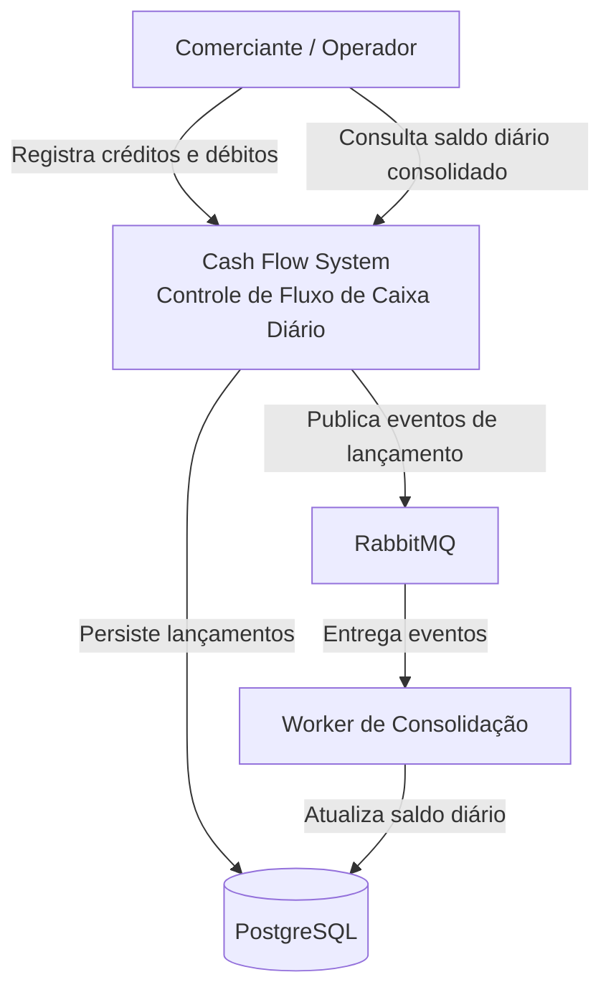
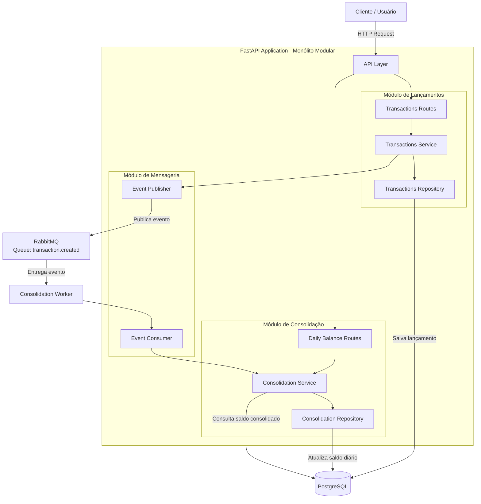
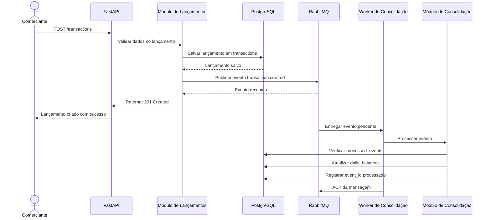
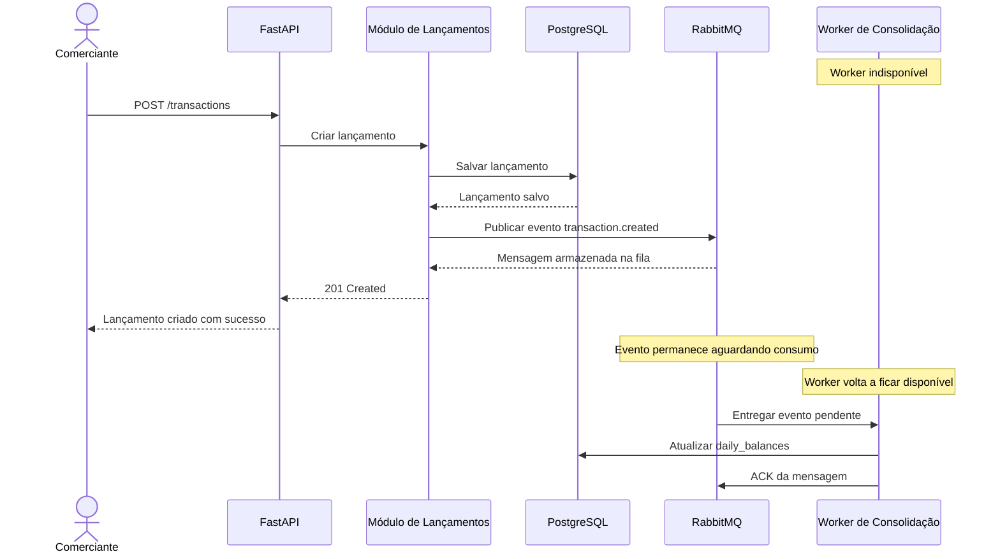
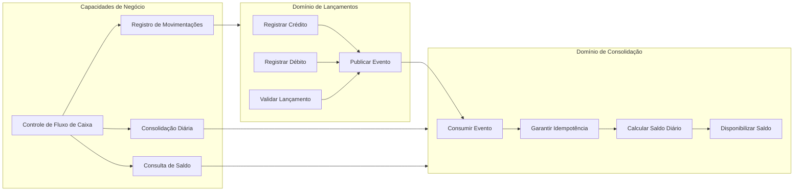
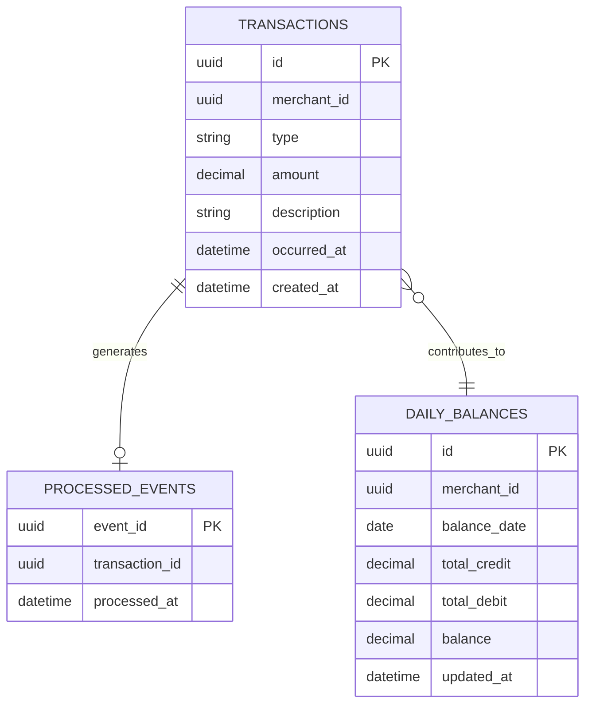
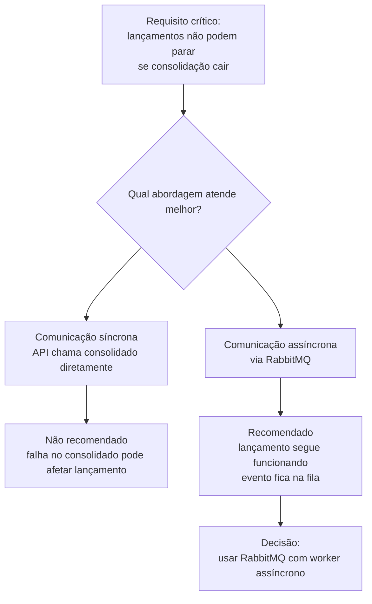

# Arquitetura

## Visão geral

A solução foi desenhada como uma arquitetura modular orientada a eventos.

O domínio de Lançamentos é responsável por registrar movimentações financeiras.

O domínio de Consolidação é responsável por calcular e disponibilizar o saldo diário.

A comunicação entre os dois ocorre de forma assíncrona via RabbitMQ, garantindo que falhas na consolidação não impactem o registro de lançamentos.

## Diagrama de contexto

## Arquitetura alvo da solução

## Fluxo de criação de lançamento

Fluxo:

1. Cliente chama `POST /transactions`.
2. API valida os dados.
3. Lançamento é salvo no banco.
4. Evento `transaction.created` é publicado no RabbitMQ.
5. API retorna sucesso.
6. Worker consome o evento.
7. Worker atualiza o saldo diário.

## Fluxo de resiliência

Se o worker de consolidação estiver indisponível:

1. O lançamento continua sendo salvo.
2. A mensagem fica na fila.
3. Quando o worker volta, a mensagem é processada.

## Diagrama de domínios e capacidades

## Modelo lógico de dados

## Diagrama de decisão arquitetural

## Descrição das tabelas

### transactions

Armazena cada lançamento financeiro individual, com `type` restrito a `CREDIT` ou `DEBIT` e `amount` em `NUMERIC(14, 2)`.

### daily_balances

Armazena a visão consolidada por comerciante e data. A restrição única em `merchant_id` + `balance_date` evita duplicidade de saldo diário.

### processed_events

Armazena os `event_id` já processados pelo worker. Essa tabela garante idempotência quando o RabbitMQ reentrega uma mensagem.

## Migrations

O schema é versionado com Alembic. No Docker Compose, o serviço `migrate` executa `alembic upgrade head` antes da API e do worker.

## Banco remoto

Supabase não foi usado nesta entrega. A arquitetura alvo usa PostgreSQL e a execução local usa o PostgreSQL do Docker Compose. Como evolução operacional, a mesma migration Alembic pode ser aplicada em um PostgreSQL gerenciado, incluindo Supabase, desde que a `DATABASE_URL` remota seja fornecida por variável de ambiente segura.

## Escalabilidade

A arquitetura escala de forma proporcional ao escopo do desafio. A API pode ser replicada horizontalmente, o worker pode ganhar mais instâncias e o RabbitMQ absorve picos temporários mantendo lançamento e consolidação desacoplados.

O principal gargalo esperado em crescimento acelerado é a atualização concorrente de `daily_balances` para o mesmo `merchant_id` e a mesma `balance_date`. O plano de evolução é primeiro escalar componentes e observar métricas, depois adicionar DLQ, retry, Outbox Pattern e alertas, e só então avaliar batch, particionamento, cache, read replicas ou extração para serviços independentes.

O plano completo está em `docs/scalability.md`.

## Trade-offs

A arquitetura modular evita a complexidade operacional de microsserviços para um domínio pequeno, mas mantém fronteiras claras para uma extração futura.

RabbitMQ adiciona um componente operacional, mas resolve o ponto mais importante do desafio: desacoplar lançamento e consolidação.

O projeto não implementa Outbox Pattern completo. Em produção, ele seria a evolução recomendada para garantir publicação de eventos mesmo em falhas entre commit no banco e envio à fila.
