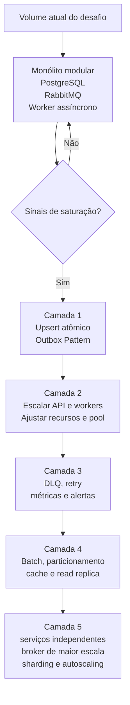

# Escalabilidade e Plano de Crescimento

## Posicionamento

A solução foi desenhada para ser escalável de forma proporcional ao desafio.

O objetivo não é entregar uma arquitetura de hiperescala desde o início, mas sim uma base simples, resiliente e evolutiva. A separação entre registro de lançamentos e consolidação diária via RabbitMQ permite absorver picos sem acoplar diretamente a disponibilidade do lançamento ao processamento do consolidado.

## O que escala na arquitetura atual

- A API FastAPI pode ser escalada horizontalmente com mais réplicas.
- O worker de consolidação pode ser escalado horizontalmente para aumentar vazão de consumo da fila, desde que a evolução para upsert atômico seja priorizada quando houver alta concorrência no mesmo saldo diário.
- RabbitMQ funciona como buffer para absorver picos temporários de eventos.
- PostgreSQL atende ao volume proposto pelo desafio com schema simples, tipos numéricos adequados e restrições de integridade.
- A arquitetura modular permite extrair módulos para serviços independentes se os domínios crescerem.

## Limites conhecidos

O principal gargalo esperado não é o endpoint HTTP de lançamento. O ponto mais sensível é a atualização concorrente de `daily_balances` para o mesmo `merchant_id` e a mesma `balance_date`.

Em um cenário com muitos eventos do mesmo comerciante no mesmo dia, múltiplos workers podem disputar a mesma linha de saldo consolidado. Isso é aceitável para o escopo do desafio, mas precisa ser observado caso o volume cresça rapidamente.

Antes de ampliar agressivamente a quantidade de workers em produção, a primeira melhoria recomendada é trocar a atualização em memória do saldo por um upsert atômico no PostgreSQL, usando `INSERT ... ON CONFLICT ... DO UPDATE`. Isso evita perda de atualização quando dois eventos do mesmo comerciante e da mesma data são processados em paralelo.

Outro limite conhecido é a ausência do Outbox Pattern completo. A implementação atual persiste a transação e publica o evento em seguida. Para produção crítica, o Outbox deve entrar junto do upsert atômico como primeira evolução técnica, garantindo consistência entre banco e fila mesmo se ocorrer falha entre o commit da transação e a publicação do evento.

## Primeira evolução técnica recomendada

Antes de adotar Kafka, Kubernetes, sharding ou microsserviços independentes, as duas primeiras evoluções técnicas devem ser:

1. Upsert atômico no consolidado.
2. Outbox Pattern na publicação de eventos.

### Upsert atômico no consolidado

A atualização de `daily_balances` deve evoluir para uma operação atômica no PostgreSQL:

```sql
INSERT INTO daily_balances (
    id,
    merchant_id,
    balance_date,
    total_credit,
    total_debit,
    balance,
    updated_at
)
VALUES (
    :id,
    :merchant_id,
    :balance_date,
    :total_credit_delta,
    :total_debit_delta,
    :balance_delta,
    NOW()
)
ON CONFLICT (merchant_id, balance_date)
DO UPDATE SET
    total_credit = daily_balances.total_credit + EXCLUDED.total_credit,
    total_debit = daily_balances.total_debit + EXCLUDED.total_debit,
    balance = daily_balances.balance + EXCLUDED.balance,
    updated_at = NOW();
```

Essa mudança reduz o risco de condição de corrida quando múltiplos workers processam eventos para o mesmo `merchant_id` e a mesma `balance_date`.

### Outbox Pattern

A criação do lançamento e o registro do evento devem acontecer na mesma transação de banco:

1. Salvar o lançamento em `transactions`.
2. Salvar o evento pendente em `outbox_events`.
3. Confirmar a transação.
4. Um publicador separado lê `outbox_events`, publica no RabbitMQ e marca o evento como publicado.

Isso evita o cenário em que a transação financeira é salva, mas o evento não chega à fila por falha temporária no RabbitMQ ou na rede.

## Sinais de alerta operacional

Os principais sinais de que a solução precisa evoluir são:

- crescimento contínuo do tamanho da fila `transaction.created`;
- aumento da latência entre criação do lançamento e atualização do consolidado;
- aumento de erros no worker;
- contenção ou timeout em atualizações de `daily_balances`;
- aumento de CPU, memória ou conexões no PostgreSQL;
- consultas ao consolidado acima do tempo aceitável para o negócio.

## Plano de evolução se o sistema escalar rápido demais

### Camada 1 - Primeira evolução técnica

- Implementar upsert atômico em `daily_balances`.
- Implementar Outbox Pattern para publicação confiável de eventos.
- Adicionar métricas mínimas de fila, publicação e consolidação.

Essa camada remove os dois riscos mais importantes antes de aumentar a concorrência do processamento.

### Camada 2 - Absorver pico imediato

- Escalar horizontalmente a API.
- Escalar horizontalmente os workers após a evolução para upsert atômico.
- Ajustar pool de conexões com PostgreSQL.
- Aumentar recursos do PostgreSQL e RabbitMQ.
- Monitorar tamanho da fila, taxa de consumo, falhas e latência de consolidação.

Essa camada preserva a arquitetura atual e usa o RabbitMQ como amortecedor de pico.

### Camada 3 - Aumentar confiabilidade operacional

- Implementar Dead Letter Queue para mensagens inválidas ou com erro recorrente.
- Implementar retry exponencial com limite de tentativas.
- Adicionar métricas Prometheus/Grafana e alertas.
- Criar runbooks operacionais para fila acumulada, falha no worker e atraso de consolidação.

Essa camada torna a operação mais segura sem transformar prematuramente o sistema em microsserviços complexos.

### Camada 4 - Otimizar consolidação

- Processar eventos em lote quando houver acúmulo de fila.
- Particionar processamento por `merchant_id` para reduzir contenção.
- Particionar tabelas por data se o volume histórico crescer muito.
- Criar índices adicionais conforme evidência de consulta real.
- Avaliar cache para consultas repetidas de saldo consolidado.
- Usar read replica para aliviar consultas de leitura, se necessário.

Essa camada ataca o gargalo mais provável: escrita e leitura do consolidado diário.

### Camada 5 - Evoluir arquitetura distribuída

Se o crescimento tornar os domínios operacionalmente independentes, a evolução natural é:

- separar API de lançamentos e consolidação em serviços independentes;
- avaliar Kafka, Pub/Sub ou outro broker se houver necessidade de maior retenção, replay ou throughput;
- aplicar sharding por `merchant_id` em cenários de altíssimo volume;
- usar autoscaling e infraestrutura gerenciada;
- evoluir observabilidade para métricas, logs centralizados e tracing distribuído;
- avaliar alta disponibilidade multi-AZ ou multi-região conforme criticidade do negócio.

Essa evolução só deve ser feita quando houver evidência de volume, criticidade e independência operacional que justifique o custo adicional.

## Diagrama do plano de escalabilidade



## Resposta arquitetural

A arquitetura atual suporta o crescimento esperado pelo desafio e tem um caminho claro de evolução. Ela não promete escala infinita, mas entrega uma fundação correta: desacoplamento assíncrono, idempotência, persistência transacional, worker separado e documentação explícita dos próximos passos.
